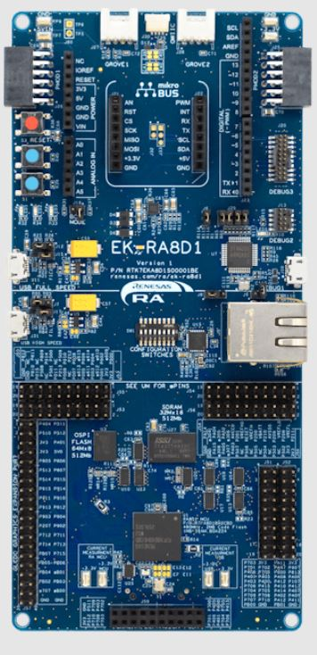

#  RA8 GPT Timer Example Application 

## Overview
The example project demonstrates typical use of GPT HAL module APIs.
User has the provision to input value as per displayed menu through JLinkRTTViewer to select different GPT supported modes(Periodic, PWM, One-Shot).
In periodic mode, user can enter the time period within the permitted ranges to change the frequency of the user LED.
In PWM mode, user can enter the duty cycle within the specified range to adjust the intensity of the user LED.
In One-Shot mode, output will be displayed on JlinkRTTViewer.
Any failure will also be displayed on JlinkRTTViewer.

## Pre-requisites
Before running the example projects, the following requirements needs to be setup in advance.

### Hardware
- EK-RA8D1
  ### Development Tools and Software
- FSP 5.2.0
- IDE: e2 studio 2024-01.1 (windows)
- Compiler: gcc - 13.2.1
### Prepare and Run the Demo
- Connect the one end of USB cable to EK-RA8D1 and other end to PC.

- 1. User is expected to enter data of size not exceeding above 15 bytes.
     Operation is not guaranteed for any user input value other than integer(i.e. float, char, special char) through RTT.
     Segger RTT block address may needed to download and observe EP operation using a hex file with RTT-Viewer.
     RTT Block address for hex file committed in repository are as follows:
     a. e2studio: 0x220004b8
     b. Keil:	0x22000008
     c. IAR: 0x22000234
 
- 2. If an EP is modified, compiled, and downloaded please find the block address (for the variable in RAM called _SEGGER_RTT) 
     in .map file generated in the build configuration folder (Debug/Release).

